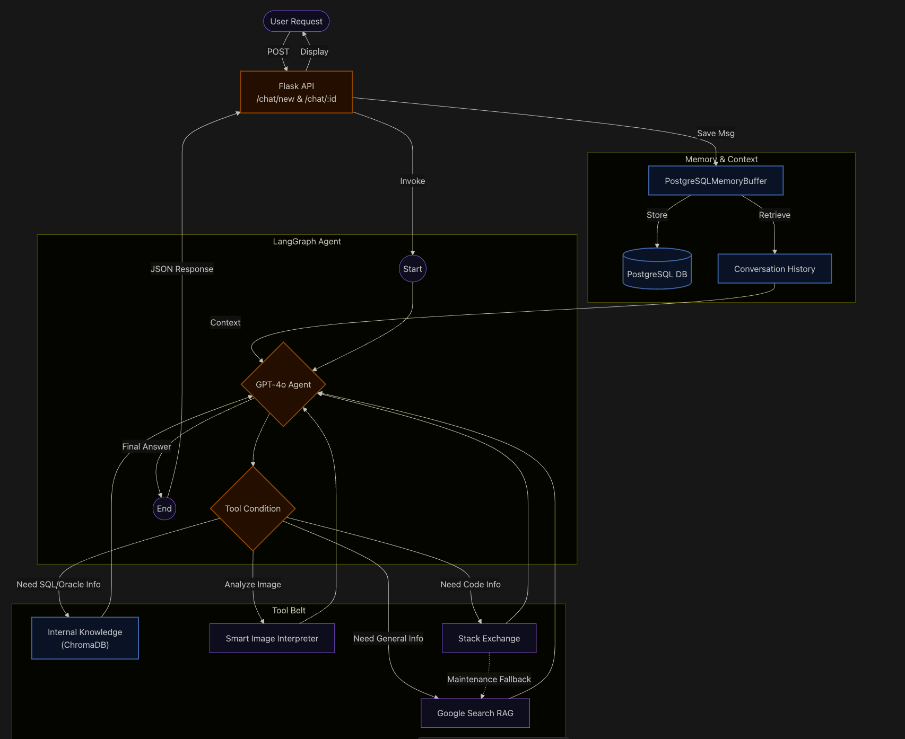
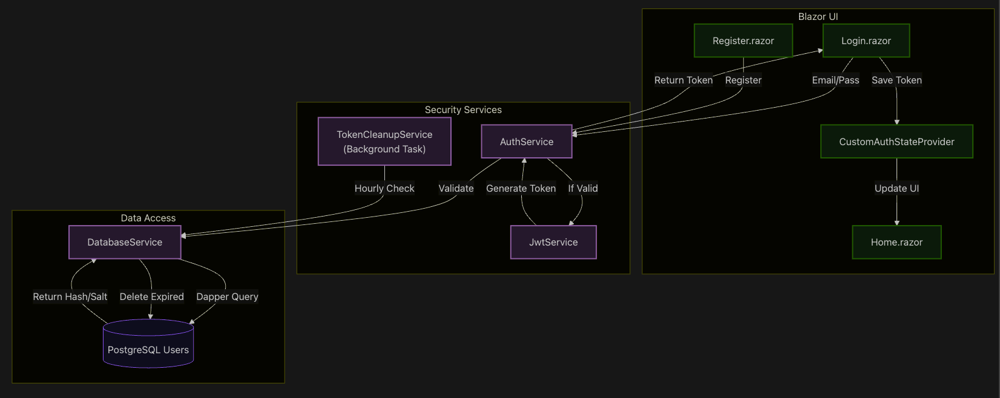

LangChain VBank (Local Kubernetes)

This repo is a full-stack AI chat application:

- Frontend: Blazor Server (.NET)
- Backend: Flask + LangChain/LangGraph (Python)
- Storage: PostgreSQL (users, chats, refresh tokens)
- Monitoring: Prometheus + Grafana (Kubernetes)

The instructions below deploy everything on a local machine using Docker Desktop Kubernetes, using Docker images you build locally (no Helm).

---

Architecture (Diagrams)

Backend chat + agent/tooling flow:

At a high level:

- A user request hits the Flask API (`/chat/new` and `/chat/:id`).
- The API invokes a LangGraph agent, which drives the LLM and decides whether tools are needed.
- Conversation memory/context is persisted to PostgreSQL (via a memory buffer), and retrieved on subsequent calls.
- The agent can optionally call “tool belt” sources (vector DB / internal knowledge, image analysis, general web search, code Q&A sources) depending on the question.
- The Flask API returns a JSON response to the UI.

Blazor UI auth + security services flow:

At a high level:

- `Register.razor` and `Login.razor` call into the auth layer.
- Tokens are generated/validated via the security services and stored client-side by the auth state provider.
- A background cleanup service periodically removes expired tokens.
- The UI updates (e.g., navigates to the home page) once authentication state changes.

---

Quick Start (Docker Desktop Kubernetes)

1) Prerequisites

- Docker Desktop (Kubernetes enabled)
- kubectl
- openssl (for generating secrets)

Verify Kubernetes is reachable:

- `kubectl config current-context` (should be `docker-desktop`)
- `kubectl get nodes`

2) Build Docker images

From the repo root:

- Backend image:
	- `docker build -t langchain:latest .`
- Frontend image:
	- `docker build -t langchain-ui:latest -f langchainUI/dockerfile langchainUI`

3) Configure secrets (Kubernetes)

This project uses Kubernetes Secrets (not `.env`) when running in k8s.

- Template: [k8s-secrets.example.yaml](k8s-secrets.example.yaml)
- Your local file (do not commit): [k8s-secrets.yaml](k8s-secrets.yaml)

Create/update secrets:

- Copy template:
	- `cp k8s-secrets.example.yaml k8s-secrets.yaml`
- Fill values in [k8s-secrets.yaml](k8s-secrets.yaml)
- Apply:
	- `kubectl apply -f k8s-secrets.yaml`

Important:

- `JWT_SECRET` must be at least 16 bytes for HS256 (32+ bytes recommended).
- `DB_PASSWORD` must match the Postgres password used by the app.

4) Deploy the application stack

Apply the main manifest:

- [k8s-deployment.yaml](k8s-deployment.yaml)
- `kubectl apply -f k8s-deployment.yaml`

Notes:

- Postgres schema is initialized automatically from `chatBotTesting.sql` via a ConfigMap mounted into `/docker-entrypoint-initdb.d/`.
- The backend is deployed as 3 replicas by default in [k8s-deployment.yaml](k8s-deployment.yaml).
- The frontend stores ASP.NET DataProtection keys on a small PVC to prevent antiforgery token failures after restarts.

5) (Optional) Deploy monitoring (Prometheus + Grafana)

Apply:

- [prometheus-k8s.yaml](prometheus-k8s.yaml)
	- `kubectl apply -f prometheus-k8s.yaml`
- [grafana.yaml](grafana.yaml)
	- `kubectl apply -f grafana.yaml`

Open Grafana:

- `kubectl get svc grafana-service`
- If EXTERNAL-IP is `localhost` (Docker Desktop often does this), open `http://localhost:3000`
- Otherwise port-forward:
	- `kubectl port-forward svc/grafana-service 3000:3000`
	- open `http://localhost:3000`

---

Scaling the backend to 3 replicas

This repo is configured to run the backend (`langchain`) as 3 replicas in [k8s-deployment.yaml](k8s-deployment.yaml).

To scale manually at any time:

- `kubectl scale deployment/langchain --replicas=3`

Verify:

- `kubectl get pods -l app=langchain`

---

Accessing the app

Frontend service:

- `kubectl get svc frontend-service`
- If EXTERNAL-IP is `localhost`, open `http://localhost:5162`
- Otherwise port-forward:
	- `kubectl port-forward svc/frontend-service 5162:5162`
	- open `http://localhost:5162`

Backend service (usually not opened directly):

- `kubectl port-forward svc/langchain-service 5001:5001`
- `http://localhost:5001/healthz`

---

What to fill and where

Kubernetes secrets (required for k8s)

Fill these in [k8s-secrets.yaml](k8s-secrets.yaml) (see [k8s-secrets.example.yaml](k8s-secrets.example.yaml)):

- Backend (`backend-secrets`)
	- `DB_PASSWORD`
	- `OPENROUTER_API_KEY`
	- `GOOGLE_API_KEY` (optional)
	- `SEARCH_ENGINE_ID` (optional)
	- `STACK_EXCHANGE_API_KEY` (optional)
- Frontend (`frontend-secrets`)
	- `JWT_SECRET`
	- `PEPPER`

Local `.env` (only for running without Kubernetes)

The file [.env](.env) is used for local/non-k8s runs. In Kubernetes, env vars come from Secrets.

---

Troubleshooting

- Pod status:
	- `kubectl get pods -o wide`
- Logs:
	- `kubectl logs deployment/frontend --tail=200`
	- `kubectl logs deployment/langchain --tail=200`
	- `kubectl logs deployment/postgres --tail=200`
- If you see antiforgery token errors after changing DataProtection/JWT settings, clear browser site data for `http://localhost:5162`.